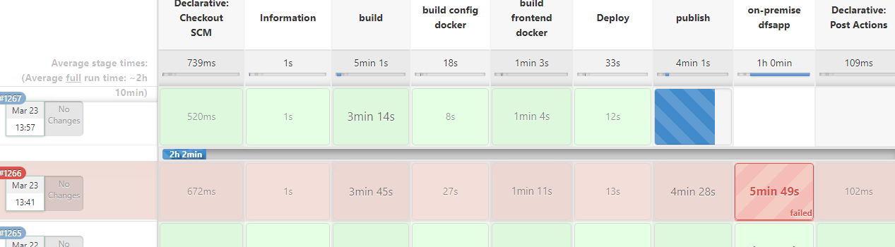

=====================================

- megabits and megabiytes;传输用mbps，存储用MB

Anyway, here we stand today, with the delineation clear: Bandwidth is measured in bits, storage capacity in bytes

====================

- three-sigma rule

```
mu  = mean of the data
std = standard deviation of the data
IF abs(x-mu) > 3*std  THEN  x is outlier
```

======================

- general availability (GA)

In the software release life cycle, general availability (GA) refers to the marketing phase when all commercialization activities pertaining to the software product have been completed and it is available for purchase.

===========================

- CS-抽取转化装载(Extract， Transform and Load)；数据抽取

**ETL是将业务系统的数据经过抽取、清洗转换之后加载到数据仓库的过程，目的是将企业中的分散、零乱、标准不统一的数据整合到一起，为企业的决策提供分析依据。** ETL是BI项目重要的一个环节。 通常情况下，在BI项目中ETL会花掉整个项目至少1/3的时间,ETL设计的好坏直接关接到BI项目的成败。    

　　ETL的设计分三部分：数据抽取、数据的清洗转换、数据的加载。在设计ETL的时候我们也是从这三部分出发。数据的抽取是从各个不同的数据源抽取到ODS(Operational Data Store，操作型数据存储)中——这个过程也可以做一些数据的清洗和转换)，在抽取的过程中需要挑选不同的抽取方法，尽可能的提高ETL的运行效率。ETL三个部分中，花费时间最长的是“T”(Transform，清洗、转换)的部分，一般情况下这部分工作量是整个ETL的2/3。数据的加载一般在数据清洗完了之后直接写入DW(Data Warehousing，数据仓库)中去

================================

- what is a PBI in software dev?

  a PBI (Product Backlog Item).

============================

# 云原生应用的三大特征：容器化封装、动态管理、面向微服务

==========================

conda command

root environment


additional environment /env

\--------------------------------------


conda env list


~~source activate myenv~~

conda activate myenv


conda list


conda install seaborn=版本号


conda update matplotlib


conda update

===========================

3-23-2021

my_wellname=cursor.execute("SELECT DISTINCT \"Well Name\" FROM WELL_PRODUCTION ")

转义，带有space的column name

=======================

work question



