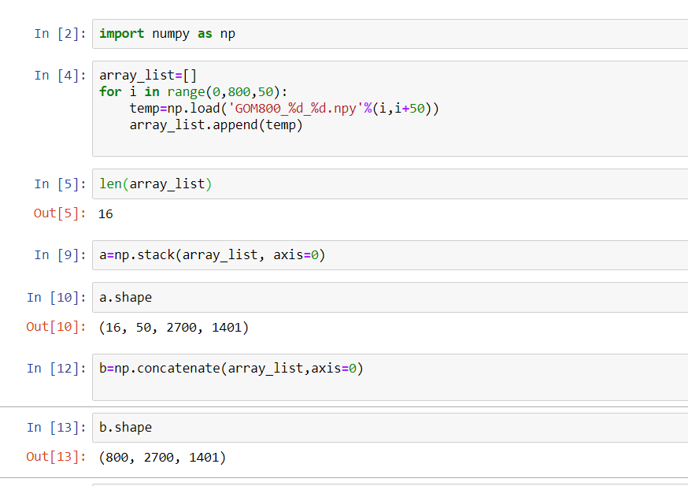

# All pythons

This file contains the python learning road of Zhili.


## Numpy

numpy index 负的也行

===================

https://datatofish.com/get-previous-current-and-next-day-system-dates-in-python/

```
import datetime
 
Current_Date_Formatted = datetime.datetime.today().strftime ('%d%m%Y') # format the date to ddmmyyyy
print ('Current Date: ' + str(Current_Date_Formatted))
 
Previous_Date = datetime.datetime.today() - datetime.timedelta(days=1)
Previous_Date_Formatted = Previous_Date.strftime ('%d%m%Y') # format the date to ddmmyyyy
print ('Previous Date: ' + str(Previous_Date_Formatted))
 
NextDay_Date = datetime.datetime.today() + datetime.timedelta(days=1)
NextDay_Date_Formatted = NextDay_Date.strftime ('%d%m%Y') # format the date to ddmmyyyy
print ('Next Date: ' + str(NextDay_Date_Formatted))
```


int8 型numpy array 200 自动转成-56


pip install opencv-python

===============================================================

**produce animation**

%matplotlib notebook

nx=100

ny=20

fig = plt.figure()

data = labelone

im = plt.imshow(data[0,:,:].T,cmap=cmap_facies)

def init():

  im.set_data(np.zeros((nx, ny)))

def animate(i):

  im.set_data(data[i,:,:].T)

  plt.title('inline%d'%i)

  plt.show()

  return im

anim = animation.FuncAnimation(fig, animate, init_func=init, frames=data.shape[0],

​                interval=50)

\# anim.save('phil_wholeset_4label_predict_only_keep_salt.gif', writer='imagemagick', fps=30)


============================

**convert onehot back**

def convert_onehot(pred):

 temp=np.argmax(pred,axis=3)

 return temp

===================================================

**numpy array to matlab**

import numpy as np

import scipy.io as io

mat_path = 'mat_A.mat'

mat = A

io.savemat(mat_path, {'name': mat})

======================================

**ipyvolume**

import numpy as np

import ipyvolume as ipv

ipv.quickvolshow(A, level=[0, 3], opacity=0.03, level_width=0.1, data_min=0, data_max=3)

==================================================

**np.concatenate**



======================================

**np.stack**

  arrays = [amp_small,raim_small,appo_small,refstr_small]

  attr_train=np.stack(arrays, axis=3)

```
all input arrays must have the same shape
```

[click](https://docs.scipy.org/doc/numpy/reference/generated/numpy.stack.html)

=====================================

**np.unique**

unique, counts = np.unique(mask_array, return_counts=True)

dict(zip(unique, counts))

==========================================

**python save fig**

​    plt.savefig('SEAM%d.png'%inline_chosen,bbox_inches='tight')

====================================================

**load keras model from json**

from keras.models import model_from_json

json_file = open('model3.json','r')

loaded_model_json = json_file.read()

json_file.close()

model = model_from_json(loaded_model_json)

model.summary()

====================================================

**plot figure loop**

plt.figure() # 循环外

for ...:

plt.plot(....)

plt.show() # 循环外

plt.close('all')

================================================

**pandas 五要素**

pandas dataframe

1. index
2. column
3. row
4. loc,iloc
5. value

======================================


## ML

=======================================

**activation function**

sigmoid

Tanh

relu, leaky relu

Softmax

===============================

**keras 神经网络 看三个**

model.compile(optimizer, loss（相当于损失函数，obj function), metrics(evaluate结果））

=========================================


f

f

f

f

f

f

f

f

f

f

f

f

f

f

f

f

f

f

f

f

f

f


## zpy

fff

fff


ffff


f

f

f

f

f

f

f

f

f

f

f

f

f

f

f

f

f


f

ffff


fffff


fff